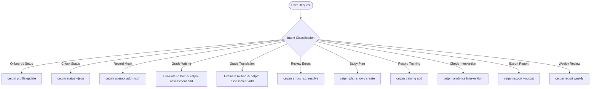

# CET Prep Manager Skill Instructions

This skill enables Antigravity and compatible AI agents to guide learners through CET-4 and CET-6 preparation. It bridges natural-language interaction with the local deterministic Python CLI (`cetpm` / `python -m cet_prep_manager`) and SQLite database.

Before the first CLI call, verify that the Python package is installed and resolve one stable,
absolute learner database path. Read [runtime.md](references/runtime.md) when the executable or
database location has not already been established. The examples below assume
`CETPM_DB_PATH` has been set to that path.

---

## 1. Core Operating Principles

1. **Deterministic Single Source of Truth:**
   - The local SQLite database is the only authority for learner performance history, error recurrence, and study plans.
   - **MANDATORY:** Always execute `cetpm status --json` or `cetpm plan show --json` before giving history-dependent diagnostics, trend commentary, or study recommendations.
   - **NEVER** hallucinate, estimate, or reconstruct historical scores from conversation memory.
2. **Clear Measurement Distinction:**
   - **Official CET Reported Score (0–710):** Store only a score from the user's actual CET
     result. Never derive or predict it from practice accuracy because the official reported score
     is norm-referenced and cannot be reconstructed from one practice paper.
   - **Objective Practice Metrics:** Exact counts (`correct_count` / `total_count`) and accuracy rates (0.00–1.00) from listening or reading practice.
   - **Subjective Estimates (1–15):** AI evaluations aligned to official anchor bands (14, 11, 8, 5, 2) accompanied by uncertainty intervals `[score_low, score_high]`.
   - **Pedagogical Diagnostic Dimensions (0–100):** Internal indicators (e.g. cohesion, syntactic variety) designed purely for student instruction; never conflate them with official scores.
3. **Uncertainty-Aware Trend Policy:**
   - A 1–2 point difference between two subjective evaluations does **not** prove progress if their confidence intervals overlap.
   - Require data sufficiency (N >= 3 for emerging trends, N >= 5 for stable trends) before asserting reliable improvement or decline.
4. **Immutable Plan Versioning:**
   - Plans are never silently altered.
   - Every plan adjustment increments the version (v1 → v2) and **requires** a recorded rationale (`rationale_md`).
5. **Copyright Boundaries:**
   - Do not reproduce full copyrighted past exam papers. Store user-provided performance metadata, error taxonomy codes, and student-generated answers.

---

## 2. Intent Routing & Workflow Guide

When the user interacts with the system, identify their intent and execute the appropriate CLI commands.



---

### Intent 1: Learner Onboarding (`cet onboard`)

**Trigger:** User introduces themselves, specifies target exam level, goal score, or exam date.

**Execution:**
```bash
python -m cet_prep_manager profile update   --exam CET6   --target-score 580   --target-date 2026-12-15   --daily-minutes 60   --name "LearnerName"
```

**Agent Response:**
- Confirm the established targets (Exam Level, Target Score, Exam Date, Daily Study Budget).
- Explain the next recommended step: complete an initial diagnostic mock or section practice.

---

### Intent 2: Status & Diagnostic Check (`cet status` / `cet analyze`)

**Trigger:** User asks "我现在的备考进度怎么样？", "听力有提高吗？", or requests a diagnostic summary.

**Execution:**
```bash
python -m cet_prep_manager status --json
```

**Interpretation Rules:**
1. Parse the JSON `LearnerStateSnapshot`.
2. Inspect `sufficiency` for each module:
   - `insufficient` (N < 3): State that data is still preliminary; avoid bold claims.
   - `emerging` (N = 3..4): Cite moving average (MA3) and observe tentative direction.
   - `usable` (N >= 5): Formally evaluate trend slope, MA5, and volatility.
3. Check `top_error_codes` to identify persistent weak points.
4. If `active_plan_id` exists, summarize active plan priorities.
5. Treat `module_balance` as a diagnostic planning aid only; it is not a 710-point conversion.

---

### Intent 3: Recording Mock Exams & Practice (`cet record`)

**Trigger:** User provides results from a completed past paper or section drill.

**Execution:**
Construct an `exam_attempt` JSON payload:
```bash
python -m cet_prep_manager attempt add --json '{
  "exam_level": "CET6",
  "attempt_type": "full_mock",
  "source_key": "2024-06-SET1",
  "source_kind": "past_paper",
  "idempotency_key": "cet6-2024-06-set1-2026-09-06",
  "duration_seconds": 7800,
  "sections": [
    {
      "section": "listening",
      "correct_count": 19,
      "total_count": 25,
      "accuracy": 0.76
    },
    {
      "section": "reading",
      "correct_count": 24,
      "total_count": 30,
      "accuracy": 0.80
    }
  ],
  "error_events": [
    {
      "section": "listening",
      "subtype": "lectures",
      "taxonomy_code": "L-LEC-INFERENCE",
      "severity": 2,
      "evidence_note": "讲座细节推断题漏听连词however"
    }
  ]
}'
```

**Agent Response:**
- Confirm the saved attempt ID.
- Provide objective accuracy percentages.
- Highlight recorded error event codes and offer targeted correction tips.

If the user supplies a score from an actual CET result report, store it separately:

```bash
python -m cet_prep_manager attempt add --exam CET6 --type official_exam --source-kind official_result --official-score 568 --idempotency-key cet6-official-2026-06
```

Never use `--official-score` for a mock or section practice. Keep practice as raw counts,
accuracy, optional `practice_index`, and subjective 1–15 estimates.

---

### Intent 4: Writing Evaluation (`cet writing`)

**Trigger:** User submits an essay for grading.

**Evaluation Protocol:**
1. **Holistic Assessment:** Map the essay to the official 5-band rubric (Anchor 14, 11, 8, 5, or 2). See [evaluation-rubric.md](references/evaluation-rubric.md).
2. **Determine Score Interval & Confidence:**
   - Specify an integer `estimated_score` (1–15), matching the persisted CLI contract.
   - Set `[score_low, score_high]` based on uncertainty.
   - Assign confidence (`high`, `medium`, `low`).
3. **Score Diagnostic Dimensions (0–100):**
   - `task_fulfillment`
   - `cohesion_organization`
   - `vocabulary_breadth`
   - `syntactic_variety`
4. **Identify Error Codes & Specific Sentence Revisions.**

**Persistence Command:**
```bash
python -m cet_prep_manager assessment add --json-input '{
  "section": "writing",
  "estimated_score": 11,
  "score_low": 10,
  "score_high": 12,
  "confidence": "medium",
  "rubric_version": "neea-public-v1",
  "assessor_provider": "openai",
  "assessor_model": "current-model",
  "skill_version": "0.1.0.dev0",
  "diagnostic": {
    "task_fulfillment": 82.0,
    "cohesion_organization": 75.0,
    "vocabulary_breadth": 78.0,
    "syntactic_variety": 70.0
  },
  "overall_rationale": "切题准确，论据充分，但在第二段转折处句式稍显单一，存在两处主谓一致小错误。",
  "revision": "【原句】There are many reasons lead to this phenomenon.\n【修改】A variety of factors account for this phenomenon."
}'
```

**Agent Feedback Format:**
```markdown
### 📝 写作评分报告 (Writing Assessment)

- **官方标准对齐估分（非官方成绩）:** 11 / 15 分（Anchor 11，区间 10 ~ 12 分）
- **评估置信度:** Medium（区间宽度 2.0 分）
- **诊断分项 (Pedagogical Diagnostics):**
  - 切题与任务完成度: 82/100
  - 篇章组织与连贯性: 75/100
  - 词汇丰富与得体性: 78/100
  - 句式多变与语法精准: 70/100

#### 🔍 核心提分建议 (Key Recommendations)
1. **修正常见语法瑕疵:** ...
2. **升级句型结构:** ...

#### ✍️ 句式升格示范 (Sentence Revisions)
- **原文:** ...
- **升格:** ...
```

---

### Intent 5: Translation Evaluation (`cet translation`)

**Trigger:** User submits a Chinese-to-English paragraph translation.

**Evaluation Protocol:**
Follow the identical two-layer evaluation architecture:
- Anchor band & uncertainty interval.
- Diagnostic dimensions: `fidelity_accuracy`, `syntactic_structure`, `lexical_appropriateness`, `fluency_readability` (0–100).
- Identify Chinglish expressions, structural omissions, or tense mismatches.
- Persist via `cetpm assessment add --section translation ...`.

---

### Intent 6: Error Review & Management (`cet errors`)

**Trigger:** User asks "我经常错哪些题？", "查看看我的错题本", or wants to resolve errors.

**Execution:**
```bash
# List persistent errors
python -m cet_prep_manager errors list --state recurrent --json

# Mark error as resolved after targeted intervention
python -m cet_prep_manager errors update <ERROR_UUID> --state resolved
```

---

### Intent 7: Dynamic Planning & Replanning (`cet plan`)

**Trigger:** User asks for a study plan, weekly review occurs, or significant performance shift is detected.

**Replanning Policy:**
A plan change is **strictly prohibited** on single-session noisy variations. A replan is only triggered when:
1. Scheduled weekly review is reached;
2. Learner explicitly requests a schedule adjustment;
3. Repeated evidence of a bottleneck emerges (e.g. 3 consecutive sessions of poor listening Section C);
4. Milestone exam result is logged;
5. Significant adherence deficit makes previous plan unfeasible.

**Execution:**
```bash
# View active plan and adherence
python -m cet_prep_manager plan show

# Create new immutable plan version
python -m cet_prep_manager plan create   --priorities "听力讲座精听抓连词, 仔细阅读长难句拆分, 写作论据句型升级"   --rationale "近3次模考听力讲座失分率持续高于35%，原定阅读重点适度向听力倾斜。"   --items '[
    {"module": "listening", "activity_type": "lectures_dictation", "target_minutes": 30, "target_count": 2, "due_date": "2026-09-20"},
    {"module": "reading", "activity_type": "careful_reading_drill", "target_minutes": 25, "due_date": "2026-09-21"},
    {"module": "writing", "activity_type": "argumentative_paragraph", "target_minutes": 20, "due_date": "2026-09-22"}
  ]'

# Update completion of planned item
python -m cet_prep_manager plan update-item <PLAN_ITEM_UUID> --status done

# Record the actual training activity
python -m cet_prep_manager training add --module listening --activity-type lectures_dictation --minutes 30 --json

# After at least two comparable observations on each side, check the exploratory response
python -m cet_prep_manager analytics intervention <TRAINING_SESSION_UUID> --json
```

---

### Intent 8: Longitudinal Excel Dashboard Export (`cet dashboard` / `cet export`)

**Trigger:** User requests an Excel export, statistics spreadsheet, or visualization dashboard.

**Execution:**
```bash
python -m cet_prep_manager export --output ./cet_prep_report.xlsx

# Deterministic observed/derived weekly Markdown report
python -m cet_prep_manager report weekly --output ./weekly_report.md --json
```

**Export Characteristics:**
- **9 Formatted Worksheets:** `Overview`, `Mock History`, `Listening`, `Reading`, `Writing`, `Translation`, `Errors`, `Plan History`, `Weekly Summary`.
- **Embedded Dynamic Charts:**
  1. `Overview`: Split dual subplot (Listening/Reading accuracy + Writing/Translation trajectories).
  2. `Listening`: Longitudinal accuracy scatter + MA3 + MA5 + OLS regression slope.
  3. `Reading`: Longitudinal accuracy scatter + MA3 + MA5 + OLS regression slope.
  4. `Writing`: CET official anchor bands (2/5/8/11/14) colored background zones + score scatter + uncertainty confidence band + MA3.
  5. `Translation`: Official anchor bands + score scatter + uncertainty confidence band + MA3.
  6. `Errors`: Top 8 taxonomy codes stacked bar chart across resolution states (`new`, `recurrent`, `improving`, `resolved`).
- Professional layout: Frozen headers, column auto-fit, auto-filters, numeric cells formatted as true numbers/percentages.

---

## 3. Skill Reference Index

- [Runtime Setup, CLI Preflight & Database Path](references/runtime.md) — read when the package,
  working directory, or learner database path is not already known.
- [CET Exam Format & Timing](references/cet-format.md)
- [Official 5-Band Evaluation Rubric & Diagnostics](references/evaluation-rubric.md)
- [Copyright & Data Boundary Policy](references/copyright-policy.md)
